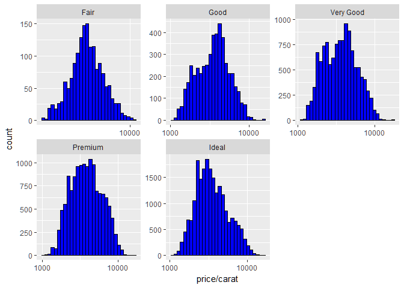
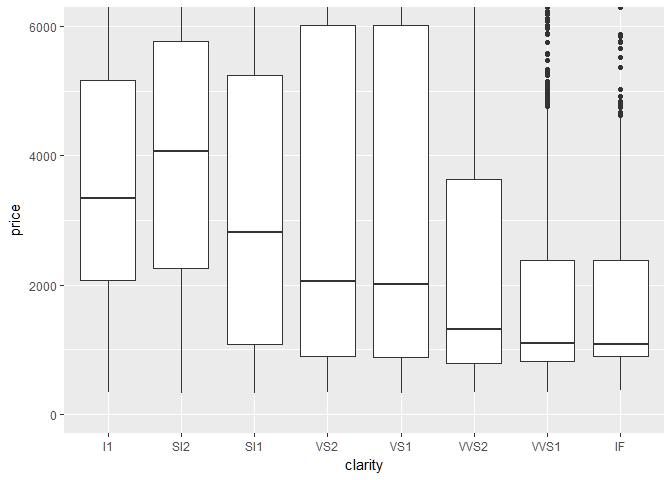
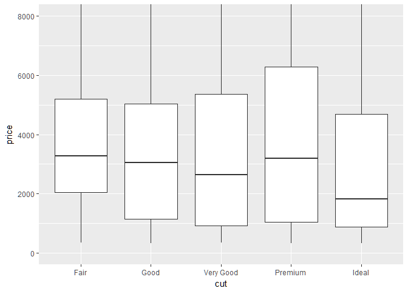
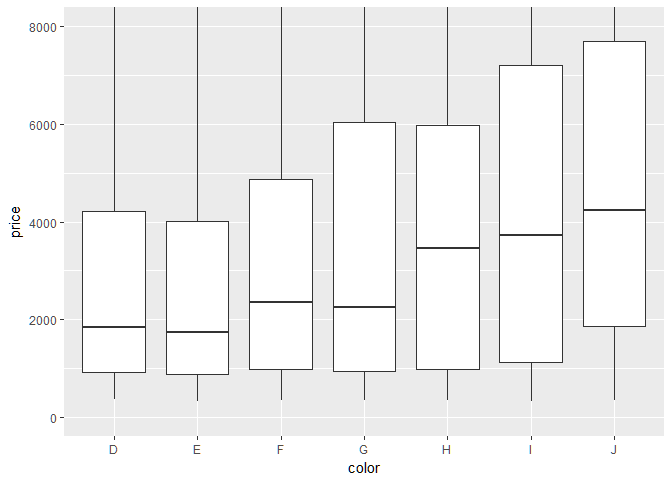
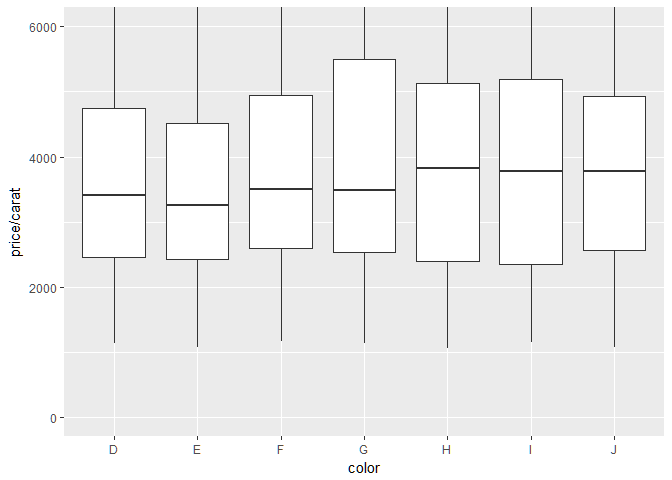
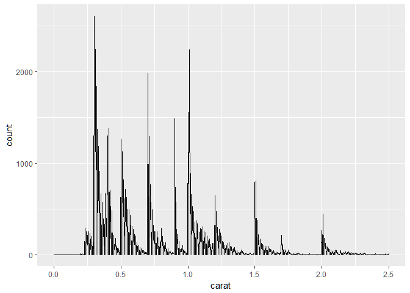

EDA Diamonds DataSet
================

## GitHub Documents

This is an R Markdown format used for publishing markdown documents to
GitHub. When you click the **Knit** button all R code chunks are run and
a markdown file (.md) suitable for publishing to GitHub is generated.

## Including Code

You can include R code in the document as follows:

``` r
library(ggplot2)
data("diamonds")
```

Number of Observations

``` r
print("Observations Variables")
```

    ## [1] "Observations Variables"

``` r
dim(diamonds)
```

    ## [1] 53940    10

Number of
    Variables

``` r
names(diamonds)
```

    ##  [1] "carat"   "cut"     "color"   "clarity" "depth"   "table"   "price"  
    ##  [8] "x"       "y"       "z"

Ordered Factors in DataSet

``` r
print("cut")
```

    ## [1] "cut"

``` r
table(diamonds$cut)
```

    ## 
    ##      Fair      Good Very Good   Premium     Ideal 
    ##      1610      4906     12082     13791     21551

``` r
print("color")
```

    ## [1] "color"

``` r
table(diamonds$color)
```

    ## 
    ##     D     E     F     G     H     I     J 
    ##  6775  9797  9542 11292  8304  5422  2808

``` r
print("clarity")
```

    ## [1] "clarity"

``` r
table(diamonds$clarity)
```

    ## 
    ##    I1   SI2   SI1   VS2   VS1  VVS2  VVS1    IF 
    ##   741  9194 13065 12258  8171  5066  3655  1790

Diamonds Dataset Summary

``` r
summary(diamonds)
```

    ##      carat               cut        color        clarity     
    ##  Min.   :0.2000   Fair     : 1610   D: 6775   SI1    :13065  
    ##  1st Qu.:0.4000   Good     : 4906   E: 9797   VS2    :12258  
    ##  Median :0.7000   Very Good:12082   F: 9542   SI2    : 9194  
    ##  Mean   :0.7979   Premium  :13791   G:11292   VS1    : 8171  
    ##  3rd Qu.:1.0400   Ideal    :21551   H: 8304   VVS2   : 5066  
    ##  Max.   :5.0100                     I: 5422   VVS1   : 3655  
    ##                                     J: 2808   (Other): 2531  
    ##      depth           table           price             x         
    ##  Min.   :43.00   Min.   :43.00   Min.   :  326   Min.   : 0.000  
    ##  1st Qu.:61.00   1st Qu.:56.00   1st Qu.:  950   1st Qu.: 4.710  
    ##  Median :61.80   Median :57.00   Median : 2401   Median : 5.700  
    ##  Mean   :61.75   Mean   :57.46   Mean   : 3933   Mean   : 5.731  
    ##  3rd Qu.:62.50   3rd Qu.:59.00   3rd Qu.: 5324   3rd Qu.: 6.540  
    ##  Max.   :79.00   Max.   :95.00   Max.   :18823   Max.   :10.740  
    ##                                                                  
    ##        y                z         
    ##  Min.   : 0.000   Min.   : 0.000  
    ##  1st Qu.: 4.720   1st Qu.: 2.910  
    ##  Median : 5.710   Median : 3.530  
    ##  Mean   : 5.735   Mean   : 3.539  
    ##  3rd Qu.: 6.540   3rd Qu.: 4.040  
    ##  Max.   :58.900   Max.   :31.800  
    ## 

Price Histogram
<!-- -->

Price Summary

``` r
summary(diamonds$price)
```

    ##    Min. 1st Qu.  Median    Mean 3rd Qu.    Max. 
    ##     326     950    2401    3933    5324   18823

Number of diamonds costs less than
$500

``` r
#qplot(x= price, data = subset(diamonds, diamonds$price<500), color = I('black'), fill = I('blue'), binwidth = 10)
sum(diamonds$price<500)
```

    ## [1] 1729

Number of diamonds costs less than
$250

``` r
#qplot(x= price, data = subset(diamonds, diamonds$price<250), color = I('black'), fill = I('blue'), binwidth = 10)
sum(diamonds$price<250)
```

    ## [1] 0

Number of diamonds costs greater than equalto
$15000

``` r
#qplot(x= price, data = subset(diamonds, diamonds$price>=15000), color = I('black'), fill = I('blue'), binwidth = 10)
sum(diamonds$price>=15000)
```

    ## [1] 1656

Exploring the large peak in price
Histogram

``` r
qplot(x= price, data = diamonds, color = I('black'), fill = I('blue'), binwidth = 20)+
  scale_x_continuous(limits = c(0,800))
```

    ## Warning: Removed 44136 rows containing non-finite values (stat_bin).

<!-- -->

``` r
 #ggsave('priceHistogram.png')
```

Price Histogram Based on Cut of the Diamond
<!-- -->
Cut with highest Priced Diamond

``` r
by(diamonds$price,diamonds$cut,max)
```

    ## diamonds$cut: Fair
    ## [1] 18574
    ## -------------------------------------------------------- 
    ## diamonds$cut: Good
    ## [1] 18788
    ## -------------------------------------------------------- 
    ## diamonds$cut: Very Good
    ## [1] 18818
    ## -------------------------------------------------------- 
    ## diamonds$cut: Premium
    ## [1] 18823
    ## -------------------------------------------------------- 
    ## diamonds$cut: Ideal
    ## [1] 18806

Cut with Lowest Priced Diamond

``` r
by(diamonds$price,diamonds$cut,min)
```

    ## diamonds$cut: Fair
    ## [1] 337
    ## -------------------------------------------------------- 
    ## diamonds$cut: Good
    ## [1] 327
    ## -------------------------------------------------------- 
    ## diamonds$cut: Very Good
    ## [1] 336
    ## -------------------------------------------------------- 
    ## diamonds$cut: Premium
    ## [1] 326
    ## -------------------------------------------------------- 
    ## diamonds$cut: Ideal
    ## [1] 326

Cut with Lowest Median Priced Diamond

``` r
by(diamonds$price,diamonds$cut,median)
```

    ## diamonds$cut: Fair
    ## [1] 3282
    ## -------------------------------------------------------- 
    ## diamonds$cut: Good
    ## [1] 3050.5
    ## -------------------------------------------------------- 
    ## diamonds$cut: Very Good
    ## [1] 2648
    ## -------------------------------------------------------- 
    ## diamonds$cut: Premium
    ## [1] 3185
    ## -------------------------------------------------------- 
    ## diamonds$cut: Ideal
    ## [1] 1810

Price Per Carat
Histogram

``` r
qplot(x= price/carat, data = diamonds, color = I('black'), fill = I('blue'))+
  scale_x_log10()+
  facet_wrap(~diamonds$cut, ncol =3,  scales = "free")
```

    ## `stat_bin()` using `bins = 30`. Pick better value with `binwidth`.

<!-- -->
Boxplots By clarity

``` r
qplot(geom="boxplot", y = price,x = clarity, data = diamonds)+
  coord_cartesian(ylim = 1:6000)
```

<!-- -->
Boxplots By cut

``` r
qplot(geom="boxplot", y = price,x = cut, data = diamonds)+
  coord_cartesian(ylim = 1:8000)
```

<!-- -->
Boxplots By color

``` r
qplot(geom="boxplot", y = price,x = color, data = diamonds)+
  coord_cartesian(ylim = 1:8000)
```

<!-- -->
Price Range for Middle 50% of the diamonds with the color D

``` r
summary(subset(diamonds,color=="D")$price)
```

    ##    Min. 1st Qu.  Median    Mean 3rd Qu.    Max. 
    ##     357     911    1838    3170    4214   18693

IQR of the diamonds with the best color

``` r
IQR(subset(diamonds,color=="D")$price)
```

    ## [1] 3302.5

Price Range for Middle 50% of the diamonds with the color J

``` r
summary(subset(diamonds,color=="J")$price)
```

    ##    Min. 1st Qu.  Median    Mean 3rd Qu.    Max. 
    ##     335    1860    4234    5324    7695   18710

IQR of the diamonds with the Worst color

``` r
IQR(subset(diamonds,color=="J")$price)
```

    ## [1] 5834.5

Price per carat of diamonds across the different colors of diamonds
using boxplots.

``` r
qplot(geom="boxplot", y = price/carat,x = color, data = diamonds)+
  coord_cartesian(ylim = 1:6000)
```

<!-- -->
The Weight of Diamonds vs carat

``` r
qplot(geom = "freqpoly", x= carat, data = diamonds , bins = 500)+
  scale_x_continuous(limits = c(0,2.5))
```

    ## Warning: Removed 126 rows containing non-finite values (stat_bin).

    ## Warning: Removed 2 rows containing missing values (geom_path).

<!-- -->
